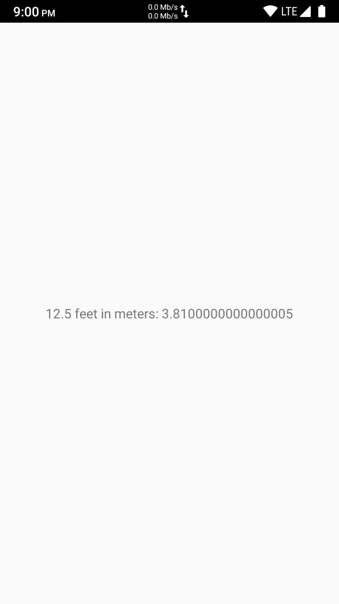

If you are an android developer, you are probably using Gradle with Android Studio to compile your apps. But have you ever wondered how gradle plugin for android compiles your app code? In this article, we are going to discuss how android apps are compiled internally and  how you can compile an android app without any large scale build system like Gradle, Buck, Ant or Bazel etc. For this example, we will use Android API 28 (pie). You can also make your build-tool (a bash script) to compile your apps without any IDE or any build tool.

# Prerequisites

## Setup JDK
First of all, you need to install and setup jdk so you can use javac to compile your source code. There are various way to install JDK depending on your OS. For more information, follow these links -> 
- https://docs.oracle.com/en/java/javase/14/install/overview-jdk-installation.html
- https://www3.ntu.edu.sg/home/ehchua/programming/howto/JDK_Howto.html

## Setup Android SDK
You also need to have Android SDK available in your system which contains necessary platform libraries and binaries to compile the app. If you are already using android-studio, you probably have it setup already. If you haven't setup it yet, you can download the commandline tool from [here](https://developer.android.com/studio/index.html#downloads) and setup sdk. Next, you need to add an enviornment variable "ANDROID_HOME" pointing to your SDK path. 

# Let's add some code
For this tutorial, we will create a simple app having textview only. So first, we need to create a directory for our project.

```bash
mkdir AndroidWithoutIDE
cd AndroidWithoutIDE
```

Now we need to add following directory for our source code.
```bash
mkdir -p src/com/amitkma/androidwithoutide
mkdir res
mkdir res/values
mkdir res/layout
mkdir libs
```
The `src` directory will contain all our java source code. The `res` directory is used for android resources like colors, drawables, layouts or values etc. `libs` directory is to hold library our application uses.

Next, we need to add necessary libraries into `libs`. For this example, I am using [android appcompat library](https://developer.android.com/topic/libraries/support-library/packages#v7-appcompat) and [Unitof.jar](https://github.com/Digidemic/UnitOf) library. As we are not going into AARs, we are using extracted app-compat library which has a jar file and a resource directory. Now your libs directory will look something like this. -> 

```bash
libs
|---res-appcompat
|---UnitOf.jar
|---appcompat-v7-23.1.1.jar
```

Create a file called `MainActivity.java` in `src/com/amitkma/androidwithoutide` and put the following contents
 ```java
 package com.amitkma.androidwithoutide;

import android.app.Activity;
import android.os.Bundle;
import android.widget.TextView;

import com.digidemic.unitof.UnitOf;

public class MainActivity extends Activity {
   @Override
   protected void onCreate(Bundle savedInstanceState) {
      super.onCreate(savedInstanceState);
      setContentView(R.layout.activity_main);
      double feetToMeters = new UnitOf.Length().fromFeet(12.5).toMeters();
      TextView view = (TextView) findViewById(R.id.textview);
      view.setText("12.5 feet in meters: " + feetToMeters);
   }
}
```
Create a file `styles.xml` in `res/values` and add the following code.
```xml
<resources>

    <!--
        Base application theme, dependent on API level. This theme is replaced
        by AppBaseTheme from res/values-vXX/styles.xml on newer devices.
    -->
    <style name="AppBaseTheme" parent="@style/Theme.AppCompat.Light.DarkActionBar">
        <item name="colorPrimary">#3F51B5</item>
        <item name="colorAccent">#FF4081</item>
    </style>

    <!-- Application theme. -->
    <style name="AppTheme" parent="AppBaseTheme">
        <!-- All customizations that are NOT specific to a particular API-level can go here. -->
    </style>

</resources>
```

Create a file `strings.xml` in `res/values`. It will hold all static strings this application uses. 
```xml
<resources>
   <string name="app_name">A Hello Android</string>
   <string name="hello_msg">Hello Android!</string>
   <string name="title_activity_main">MainActivity</string>
</resources>
```
Next we will add the layout file `activity_main` in `res/layout` which basically has the UI components drawn by `MainActivity.java`.
```xml
<RelativeLayout xmlns:android="http://schemas.android.com/apk/res/android" xmlns:tools="http://schemas.android.com/tools"
   android:layout_width="match_parent"
   android:layout_height="match_parent" >
   
   <TextView
      android:layout_width="wrap_content"
      android:layout_height="wrap_content"
      android:layout_centerHorizontal="true"
      android:layout_centerVertical="true"
      android:text="@string/hello_msg"
      android:id="@+id/textview"
      tools:context=".MainActivity" />
</RelativeLayout>
```

The last file which we need to add in our project is the `AndroidManifest.xml`. 
```xml
<?xml version="1.0" encoding="utf-8"?>
<manifest xmlns:android="http://schemas.android.com/apk/res/android" 
	package="com.amitkma.androidwithoutide" 
	android:versionCode="10001" 
	android:versionName="1.0.1">

	<uses-sdk
        android:minSdkVersion="21"
        android:targetSdkVersion="29" />
        
    <application android:label="HelloAndroidFromCLI"
    	android:theme="@style/AppTheme">
        <activity android:name="com.amitkma.androidwithoutide.MainActivity">
             <intent-filter>
                <category android:name="android.intent.category.LAUNCHER"/>
                <action android:name="android.intent.action.MAIN"/>
             </intent-filter>
        </activity>
    </application>
</manifest>
```

# Compile the code
Android app code is compiled in majorly 5 steps. 
1. App resources's are parsed and flatten. 
2. Next, those resources are linked and mapped to unique ids so that android can figure out which resources to use when. Basically its the step when `R.java` is generated. 
3. The java sources are compiled and `.class` files are generated.
4. The d8 dexer then converts `.class` bytecode into dex format which is android specific bytecode.
5. Dex files and resource apk is zipped together and signed. 

We will go through each step. 

## Compiling resources. 
Create a directory called `compiled_res` in the root of your project. This directory will contain the flatten resource table.
```bash
mkdir compiled_res
```
Use aapt2 to compile the resources.
```bash
# Compiling the app resources
$ANDROID_HOME/build-tools/29.0.2/aapt2 compile --dir res -o compiled_res/resources.zip
# Compiling the app-compat resources
$ANDROID_HOME/build-tools/29.0.2/aapt2 compile --dir libs/res-appcompat -o compiled_res/res-appcompat.zip
```

## Linking resources
Create a directory called `gen` to generate R.java file inside it and also create an `out` directory to generate the temporary apk.
```bash
mkdir gen
mkdir out
```
Use aapt2 to link these resources. 
```bash
$ANDROID_HOME/build-tools/29.0.2/aapt2 link compiled_res/resources.zip compiled_res/res-appcompat.zip -I $ANDROID_HOME/platforms/android-29/android.jar \
 --auto-add-overlay \
 --manifest AndroidManifest.xml \
 --java gen \
 -o out/res.apk

# The compiled_res directory is not required anymore.
rm -rf compiled_res 
```
- -I	Provides the path to the platform's android.jar or other APKs like framework-res.apk which might be useful while building features.
- --auto-add-overlay	Allows the addition of new resources in overlays without using the <add-resource> tag.
- --manifest file	Specifies the path to the Android manifest file to build.
- --java directory	Specifies the directory in which to generate R.java.
- -o path	Specifies the output path for the linked resource APK.

After completing the above steps, you can see that a `res.apk` is generated inside `out` directory but it won't run on the device because it doesn't contain any `classes.dex` file. The `R.java` can now be found inside `gen`.

## Compiling source files
We use the following command to compile our source files. 
```bash
# Create obj directory
mkdir obj
javac -source 1.8 -target 1.8 -bootclasspath $ANDROID_HOME/platforms/android-29/android.jar -cp appcompat-v7-23.1.1.jar:UnitOf.jar -d obj $(find src gen -type f -name '*.java')

# The gen directory is not required anymore.
rm -rf gen 
```

This step will generate a `.class` files for all the java files we have inside `src` and `gen` directory. 

## Dexing the class files
To dex the class files using d8 tool, use the following command. 
```bash
# Create the dex directory to hold dex file.
mkdir dex

# Generate dex files.
$d8 $(find obj -type f -name '*.class') UniOf.jar appcompat-v7-23.1.1.jar --release \
	--classpath $ANDROID_HOME/platforms/android-29/android.jar \
	--lib $ANDROID_HOME/platforms/android-29/android.jar \
	--output dex

# The obj directory is not required anymore.
rm -rf obj
```
You can now see a `classes.dex` file is generated inside `dex` directory. This is the file we need to include in our resource apk. 

## Zipping and Signing APK
In this step, we zip the dex files with apk and sign it using apksigner. 
```bash
# Add classes.dex into out/res.apk
zip -uj out/res.apk dex/classes.dex

# Delete dex files as they are not required anymore. 
rm -rf dex

# Use zipalign to generate an aligned and unsigned apk.
$ANDROID_HOME/build-tools/29.0.2/zipalign -f 4 out/res.apk out/app_unsigned.apk

# Delete out/res.apk 
rm out/res.apk

# Use APK Signer to sign your apk using debug certifacte.
$ANDROID_HOME/build-tools/29.0.2/apksigner sign --ks debug.keystore --ks-pass pass:android --out out/app_signed.apk out/app_unsigned.apk

# Delete unsigned apk. 
rm -f app_unsigned.apk
```

# Install and Run App
```bash
adb install out/app_signed.apk
adb shell am start -n com.amitkma.androidstudiowithoutide/.MainActivity
```
This screens should be displayed if everything goes well.



If you get any error while starting your application, try the following command to debug the issue. 
```bash
adb logcat
```

# Final Words
If you are reading this far, Thank you very much. There are many limitaions directly on manually compiling the app and hence this approach is not for any production project. It only tells you how you can build apps from command line and how actually any build tool works internally. All build-tools do the same task under the hood. You can explore the possibility and maybe comeup with a new build tool which can be used for large scale projects. If you want to checkout a working project, go to this link - https://github.com/amitkma/Bacol

# References
1. aapt2 - https://developer.android.com/studio/command-line/aapt2
2. d8 - https://developer.android.com/studio/command-line/d8
3. zipalign - https://developer.android.com/studio/command-line/zipalign
4. apksigner - https://developer.android.com/studio/command-line/apksigner
5. Related Project - https://github.com/amitkma/Bacol
